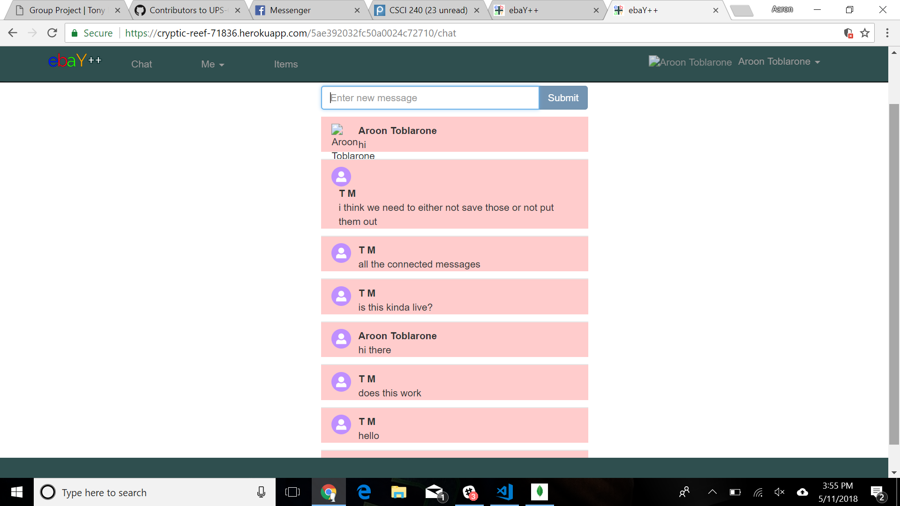
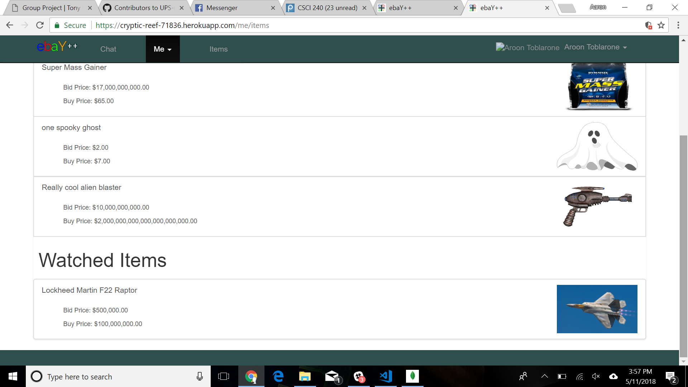
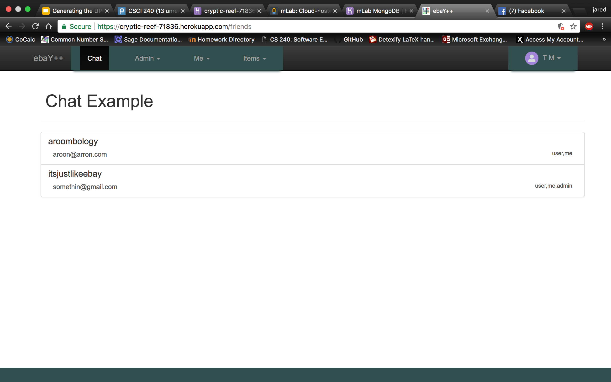
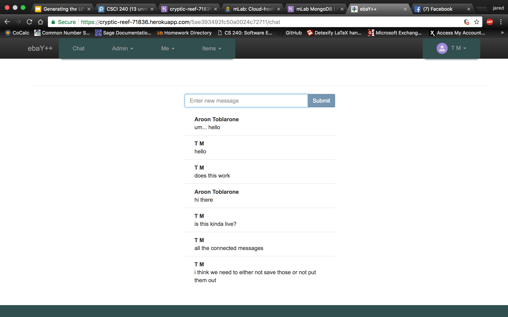
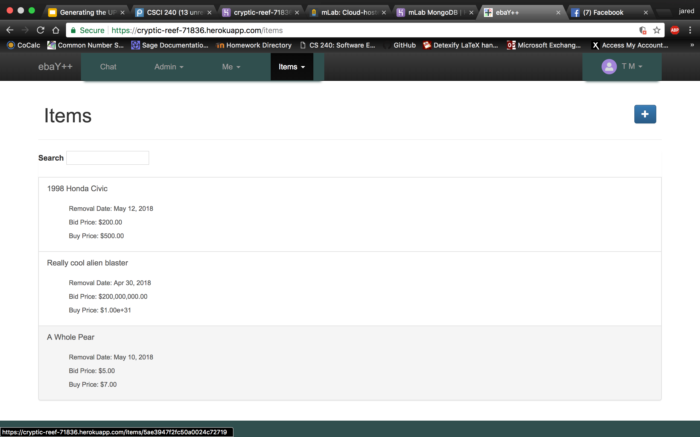
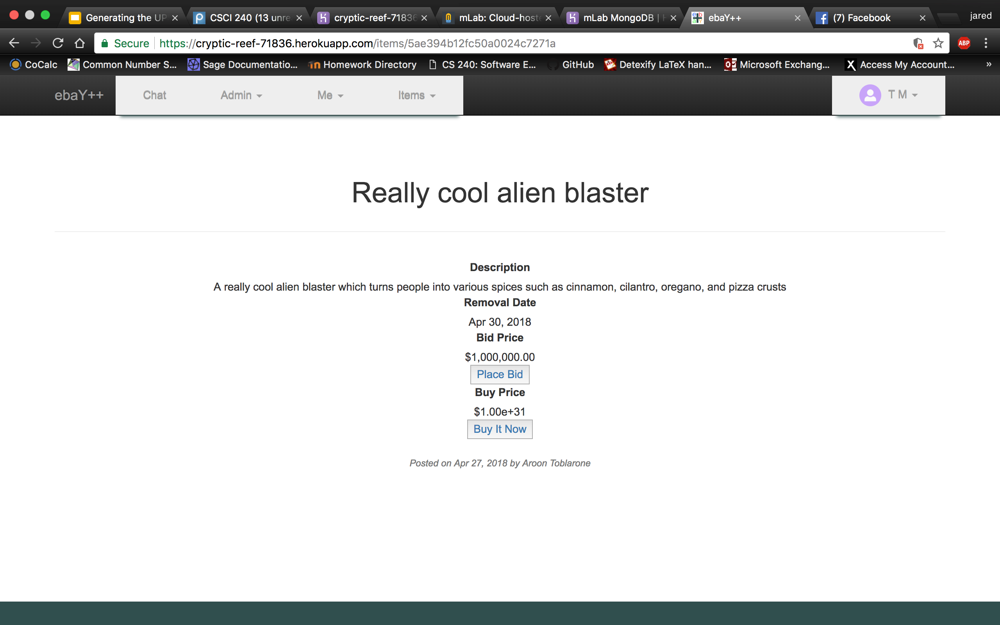
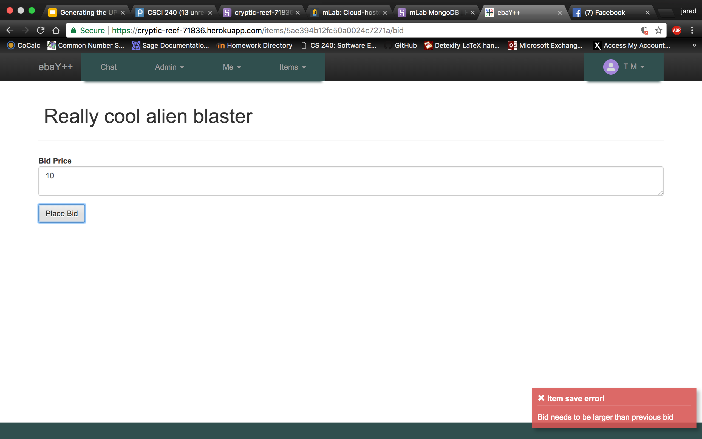
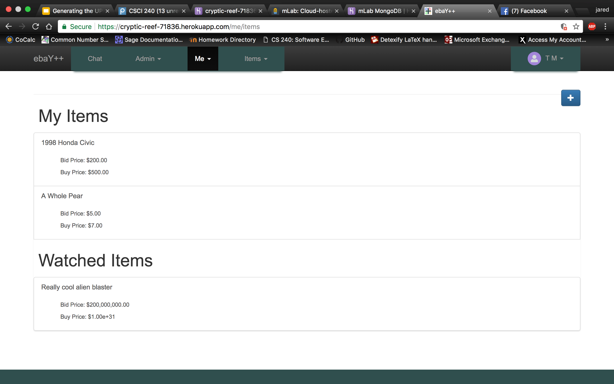

-------------------------------------------------
Iteration 5.0: https://cryptic-reef-71836.herokuapp.com/

## Messages are now colorful

## Users can now watch items and view a list of their watched items

## Item pictures are now added!!!!

Admin User for Heroku Deployment:
    Username: itsjustlikeebay
    Password: Universa1PaperClip$

Notes:

The final iteration of our website has gotten us very close to the ideas we had at the outset. We have peer to peer messaging, and we have a way for people to buy, sell, and auction goods. There is a user page that gives all the needed info that one would expect for a good shopping experience

Breakdown:
1. Aaron Thomson:
    - added message color filter back in
    - Help Jared with the add credit card functionality
    - Made buy it now functional
2. Jared Polonitza:
    - Images on items
    - Credit cards saved in database
3. Braden Ash:
    ?
4. Skye Guegan:
    - Error Correction
    - Completed Watch Button + Func
    - Added Watched items to Manage My Items Page
5. Lukas Jimenez-Smith
    ?
-------------------------------------------------
Iteration 4.0: https://cryptic-reef-71836.herokuapp.com/

## List of all the people available to chat

## Private chat rooms for two

## Elegant new styling for the items list page

## Sleek and beautiful listings for individual items

## NEW FEATURE ALERT: Bidders can no longer win items by bidding lower than previous bids!!! WOW!

## See all of the items YOU want to buy (and those you want to sell too)!

Admin User for Heroku Deployment:
    Username: itsjustlikeebay
    Password: Universa1PaperClip$

Notes:

The third iteration of the website has added much more functionality. We now have a user page that allows a user to edit their information, as well as keep track of items they have listed, and those they want to bid on. We also now have a working framework for private messaging. We hope to add more functionality and style to the template, but as of now we are returning messages to closed pairs of users.

Breakdown:
1. Aaron Thomson:
    - Co-create private messaging
    - colorfiltering messages by corresponder
2. Jared Polonitza:
    - Create User Page
    - Co-create private messaging
    - Update Readme
3. Braden Ash:
    - working on creating angular slideshow
    - working on making buy it now functional
4. Skye Guegan:
    - Error Correction
    - Watch Button + Func
    - Update Item Db to include watchers
5. Lukas Jimenez-Smith
    - New homepage
    - Css Styling
    - New Logo
    - New tab display picture
-------------------------------------------------
Iteration 3.0: https://pacific-dawn-56409.herokuapp.com/

Admin User for Heroku Deployment:
    Username: itsjustlikeebay
    Password: Universa1PaperClip$

Notes:
This second iteration of our mean stack project hosts most of the body for our ebaY++ project. In this tag we are setting up an entire frot end HTML and CSS framework as well as back end features such as bidding, paying, viewing and selling items. - Lukas Jimenez-Smith
Breakdown:
1. Aaron Thomson:
    Helped implement user messaging, mostly in the controller, socket server config file, and the view, including a jquery filter on out messages that isn't quite finished yet
2. Jared Polonitza:
    -
3. Braden Ash:
    -
4. Skye Guegan:
    - Set up Removal Date
    - Remove items from display that are expired
5. Lukas Jimenez-Smith
    - Update readme
    - Finish CSS and HTML for website
    - help clear up bugs

-------------------------------------------------
Iteration 2.0: https://pacific-dawn-56409.herokuapp.com/

Admin User for Heroku Deployment:
    Username: itsjustlikeebay
    Password: Universa1PaperClip$

Notes:
The first iteration has largely consisted of the creation of the items module for eBay++. The items module is functioning as our listings and search page, similar to what is seen on ebay. While our search is much more limited, we do have the ability to search through all available items in our database to find the item of your choice. When a user is logged in (read: has admin permission) they are able to create an item, as well as bid on an item. Both actions are associated with that specific users ObjectId, which will be used for later functionality. - Jared Polonitzas
Breakdown:
1. Aaron Thomson:
    -
2. Jared Polonitza:
    -
3. Braden Ash:
    -
4. Skye Guegan:
    - Set up bidding
5. Lukas Jimenez-Smith
    - Update README
    - Item Framewok in HTML with picture

-------------------------------------------------
Iteration 1.0: https://pacific-dawn-56409.herokuapp.com/

Notes:
Querying a database using mongodb is a little less straightforward than SQL unfortunately. Some of the logic for checking whether a user is logged in or not is tricky and fun to mess with. - Jared Polonitza

Breakdown:
1. Aaron Thomson:
    - Modify client controller to have public v private event
    - Modify model schema to add atribute for public v private
2. Jared Polonitza:
    - Add button to add private event, only visible when logged in
    - Modify listing functionality to query db apropriately
3. Braden Ash:
    - Create a 403 response for improper creditials when creating a private event
    - Modify CSS
4. Skye Guegan:
    - Test case on line 223
    - Test case on line 227
5. Lukas Jimenez-Smith
    - Test case on line 231
    - Test case on line 235

-------------------------------------------------
Group Members:
1. Jared Polonitza
2. Aaron Thompson
3. Lukas Jimenez-Smith
4. Braden Ash
5. Skye Guegan
